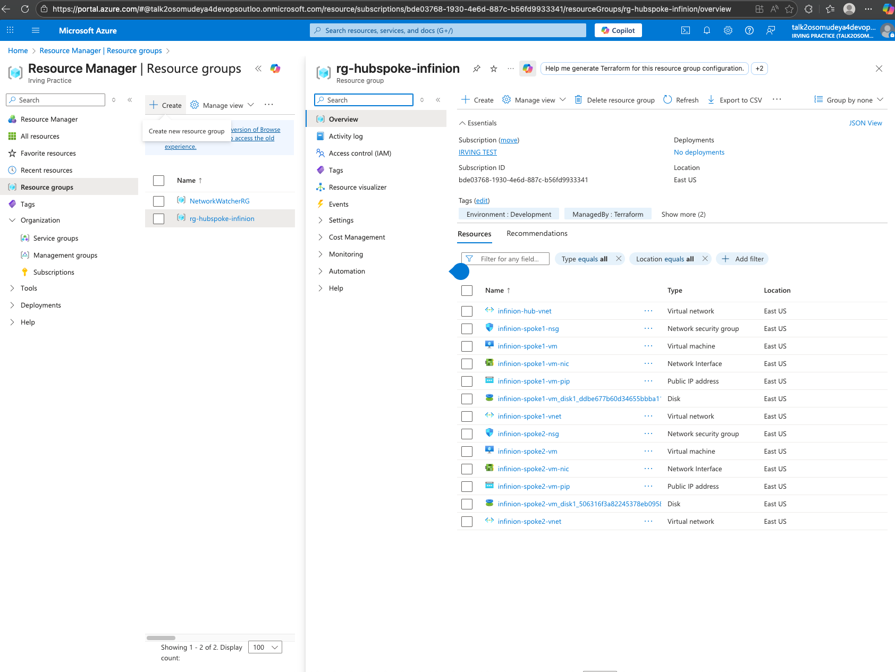
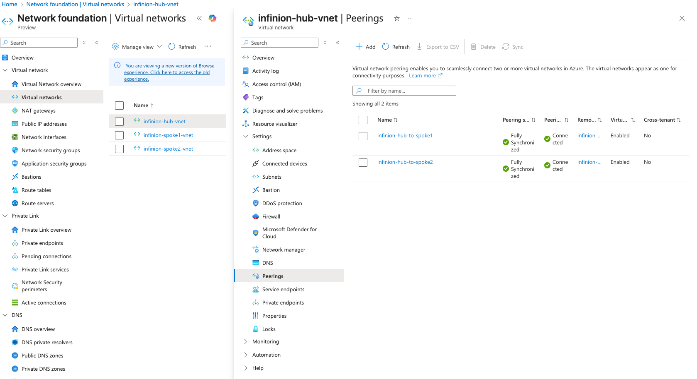
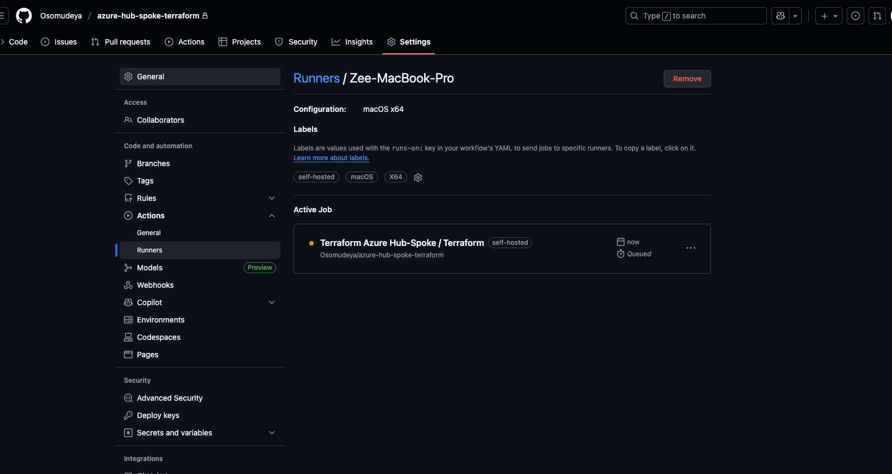
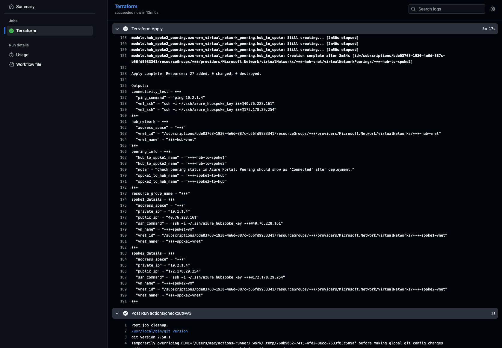

# Azure Hub-Spoke Network Topology with Modular Terraform

**GitHub Repository:** [https://github.com/Osomudeya/azure-hub-spoke-terraform](https://github.com/Osomudeya/azure-hub-spoke-terraform)

Modular Terraform solution for deploying Azure Hub-Spoke network architecture.

> **Assessment Solution:** This repository fulfills the Cloud Infrastructure Engineer assessment requirements, demonstrating reusable Terraform modules, Hub-Spoke network topology, self-hosted GitHub Actions runner, and comprehensive documentation.

## Architecture

### Network Topology Diagram


*Visual representation of the Hub-Spoke network topology showing:*
- *Hub VNet (10.0.0.0/16) with Hub Subnet (10.0.1.0/24)*
- *Spoke 1 VNet (10.1.0.0/16) with Subnet (10.1.1.0/24) containing VM1*
- *Spoke 2 VNet (10.2.0.0/16) with Subnet (10.2.1.0/24) containing VM2*
- *NSG applied at subnet level*
- *VNet peering at VNet level*
- *Direct spoke-to-spoke peering enabling VM-to-VM communication*

### Peering Connections

```
Hub ↔ Spoke1:  Bidirectional peering (Hub-to-Spoke1, Spoke1-to-Hub)
Hub ↔ Spoke2:  Bidirectional peering (Hub-to-Spoke2, Spoke2-to-Hub)
Spoke1 ↔ Spoke2: Direct bidirectional peering (enables VM-to-VM communication)
```

### Network Flow

**VM1 to VM2 Communication Path:**
1. VM1 (10.1.1.4) → Spoke1 Subnet (10.1.1.0/24)
2. Spoke1-to-Spoke2 Peering
3. Spoke2 Subnet (10.2.1.0/24) → VM2 (10.2.1.4)

**SSH Access:**
- VM1: `ssh -i ~/.ssh/azure_hubspoke_key azureuser@40.76.228.161`
- VM2: `ssh -i ~/.ssh/azure_hubspoke_key azureuser@172.178.29.254`

## Features

- **Modular Architecture** - Separate modules for reusability
- **Hub-Spoke Network Topology** - Enterprise design pattern
- **Bidirectional VNet Peering** - Full mesh connectivity through hub
- **Dynamic NSG Rules** - Configurable cross-spoke communication
- **Scalable Design** - Easy to add new spokes
- **2 Linux VMs** (Ubuntu 22.04) with SSH key authentication
- **Cost-Optimized** (Standard_B1s VMs)
- **GitHub Actions CI/CD** with self-hosted runner
- **Ready** with comprehensive documentation

## Module Structure

```
modules/
├── resource-group/       # Shared resource group
├── hub-network/          # Hub VNet and subnet
├── spoke-network/        # Reusable spoke (VNet, subnet, VM, NSG)
└── vnet-peering/         # Bidirectional VNet peering
```

## Steps I Took

### 1. Generated SSH Key
```bash
ssh-keygen -t rsa -b 4096 -f ~/.ssh/azure_hubspoke_key
```

### 2. Get Public IP
```bash
curl https://api.ipify.org
```

### 3. Configure Variables
Edit `environments/dev/terraform.tfvars`:
```hcl
resource_group_name = "rg-hubspoke-infinion"
prefix              = "name" 
ssh_public_key      = "SSH_PUBLIC_KEY"
admin_source_ip     = "MY_IP/32"
```

### 4. Deploy Infrastructure
```bash
cd environments/dev
terraform init
terraform fmt -check
terraform plan
terraform apply -auto-approve
```

### 5. Test Connectivity
```bash
# SSH to VM1 (Spoke1)
terraform output -json spoke1_details | jq -r '.ssh_command'
ssh -i ~/.ssh/azure_hubspoke_key azureuser@172.178.29.254

# From VM1, ping VM2 private IP
ping $(terraform output -json spoke2_details | jq -r '.private_ip')
ping -c 4 10.1.1.4
```

### 6. Cleanup
```bash
terraform destroy -auto-approve
```

## Network Configuration

| Component | Address Space | Purpose |
|-----------|--------------|---------|
| Hub VNet | 10.0.0.0/16 | Central connectivity hub |
| Hub Subnet | 10.0.1.0/24 | Hub subnet |
| Spoke 1 VNet | 10.1.0.0/16 | VM1 workload |
| Spoke 1 Subnet | 10.1.1.0/24 | VM1 subnet |
| Spoke 2 VNet | 10.2.0.0/16 | VM2 workload |
| Spoke 2 Subnet | 10.2.1.0/24 | VM2 subnet |


## Assessment Requirements - Complete Solution

This solution addresses all assessment requirements:

### ✅ Requirement 1: Reusable Terraform Module
- **Azure Resource Group:** [`modules/resource-group/`](modules/resource-group/)
- **Azure VNets and Subnets:** [`modules/hub-network/`](modules/hub-network/) and [`modules/spoke-network/`](modules/spoke-network/)
- **NSG (Network Security Groups):** Included in [`modules/spoke-network/`](modules/spoke-network/)
- **2 VMs:** Deployed via reusable spoke-network module

### ✅ Requirement 2: Hub and Spoke Network Topology
- **Hub VNet:** `10.0.0.0/16` - Central connectivity point
- **Spoke VNet1:** `10.1.0.0/16` - Contains VM1
- **Spoke VNet2:** `10.2.0.0/16` - Contains VM2
- **VNet Peering:** Bidirectional peering via [`modules/vnet-peering/`](modules/vnet-peering/)

### ✅ Requirement 3 & 4: VM Deployment
- **VM1:** Deployed in Spoke VNet1 (10.1.1.0/24 subnet)
- **VM2:** Deployed in Spoke VNet2 (10.2.1.0/24 subnet)
- Both VMs use cost-optimized `Standard_B1s` size

### ✅ Requirement 5: VM1 Should Reach VM2
- NSG rules configured to allow cross-spoke communication
- Connectivity tested via ping from VM1 to VM2 private IP
- See [Connectivity Testing](#connectivity-testing) section below

### ✅ Requirement 6: Cost Optimization and Cleanup
- **Cost-Optimized:** Standard_B1s VMs
- **Cleanup:** `terraform destroy` command provided
- **Resource Management:** All resources tagged for easy identification

### ✅ Requirement 2 (Self-Hosted Runner)
- **GitHub Actions Runner:** Configured and documented in `GITHUB_RUNNER_SETUP.md`
- **Workflow:** `.github/workflows/terraform.yml` uses self-hosted runner
- **CI/CD:** Automated Terraform plan/apply on push to main branch and also using workflow dispatch for manual run

## Screenshots and Documentation Snapshots

### Infrastructure Deployment

*Terraform successfully deployed all resources*

### Azure Portal - Resource Overview

*All resources deployed in the resource group*

### Network Topology

*VNet peering status showing "Connected" between Hub and Spokes*

### Connectivity Testing

*Successful ping from VM1 (10.1.1.4) to VM2 (10.2.1.4) via private IP*

### GitHub Actions Self-Hosted Runner

*Self-hosted runner showing as "Active" in GitHub Actions*


*Successful Terraform workflow execution using self-hosted runner*

## Connectivity Testing

### Test VM1 to VM2 Connectivity

```bash
# 1. Get VM1 SSH command
terraform output -json spoke1_details | jq -r '.ssh_command'

# 2. SSH into VM1
ssh -i ~/.ssh/azure_hubspoke_key azureuser@<VM1_PUBLIC_IP>

# 3. From VM1, ping VM2 private IP
ping -c 4 10.2.1.4
```

**Expected Output:**
```
PING 10.2.1.4 (10.2.1.4) 56(84) bytes of data.
64 bytes from 10.2.1.4: icmp_seq=1 ttl=63 time=1.23 ms
64 bytes from 10.2.1.4: icmp_seq=2 ttl=63 time=1.15 ms
64 bytes from 10.2.1.4: icmp_seq=3 ttl=63 time=1.18 ms
64 bytes from 10.2.1.4: icmp_seq=4 ttl=63 time=1.20 ms
```

This confirms successful connectivity between VM1 and VM2 through the Hub VNet peering.

## Troubleshooting

### Issue 1: VM1 Cannot Reach VM2 (Spoke-to-Spoke Communication)

**Problem:** After deployment, VM1 in Spoke1 cannot ping VM2 in Spoke2, even though both are peered to the Hub.

**Cause:** In a hub-spoke topology, spokes communicate through the hub by default. However, for direct VM-to-VM communication between spokes, I need actual spoke-to-spoke peering.

**Solution:** I included direct spoke-to-spoke peering resources.

```bash
# Checked peering status in Azure Portal
# Navigated to: VNet → Peerings → Verify both spoke1-to-spoke2 and spoke2-to-spoke1 show "Connected"
```


**Test:** SSH to VM1 and ping VM2's private IP:
```bash
ssh -i ~/.ssh/azure_hubspoke_key azureuser@<VM1_PUBLIC_IP>
ping -c 4 10.2.1.4
```

### Issue 2: SSH Access Denied - Dynamic IP Address

**Problem:** SSH connection fails with "Permission denied" or NSG blocks access.

**Root Cause:** Public IP address changes (home network, VPN, etc.), and the NSG rule only allows original IP.

**Solution (GitHub Actions):** The workflow automatically detects my current IP using `curl https://api.ipify.org` and passes it to Terraform. No manual intervention needed when deploying via GitHub Actions.

```bash
# Get your current public IP
curl https://api.ipify.org

# Update terraform.tfvars
admin_source_ip = "YOUR_CURRENT_IP/32"

# Apply the change
cd environments/dev
terraform apply -target=module.spoke1_network.azurerm_network_security_rule.ssh -target=module.spoke2_network.azurerm_network_security_rule.ssh
```

### Issue 3: GitHub Self-Hosted Runner Not Picking Up Jobs

**Problem:** Workflow shows "Waiting for a runner to pick up this job..." indefinitely.

**Cause:** The runner process is not running on my local machine.

**Solution:** I restarted the runner:
```bash
cd ~/actions-runner
./run.sh
```

**Alternative Solution:** Install as a service (auto-starts on boot and runs in background):
```bash
cd ~/actions-runner
./svc.sh install
./svc.sh start
```

**Session Conflict Error:** Got errors like "A session for this runner already exists":
```bash
# Stopped all runner processes
cd ~/actions-runner
./svc.sh stop
pkill -f "Runner.Listener"
pkill -f "actions-runner"

# Start fresh
./run.sh
```